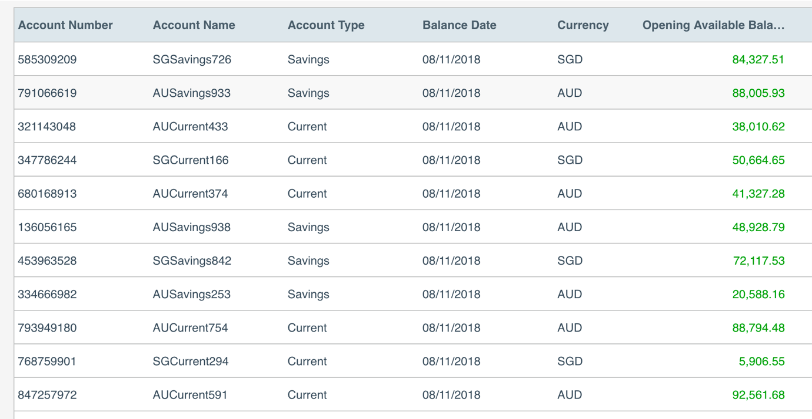
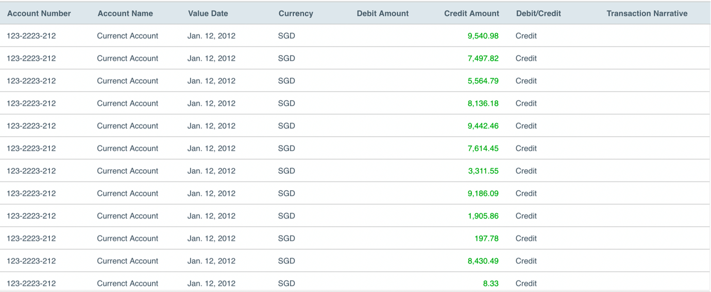

# Sample Project (Backend Development)

The sample application being requested by the candidate to build the backend REST APIs needed to support a web application to that allows a user to view accounts and subsequently view transactions on any of the accounts they hold. 
Required functionality:
- View account list.
- View account transactions.

## Guidelines:
UI Not applicable and outside of the scope of this project. 

## Backend 
Utilise standard java and spring boot (I used node.js in this instance of the test) projects as a base. Add any other framework as necessary. 

## Delivery 
Code can be checked into github and shared back to the team for assessment. 

## Account List Enquiry 
After logging in (outside of scope), a user will be presented with a list of their accounts in a table, with the basic account attributes on display (Account Number, Account Name, Account Type, Balance Data, Currency, Opening Available Balance):

## Account Transaction Enquiry 
Upon selecting an account, a user will be presented with a list of transactions made on the selected account as a new screen. The user can navigate back to the account selection screen to reselect a different account:

